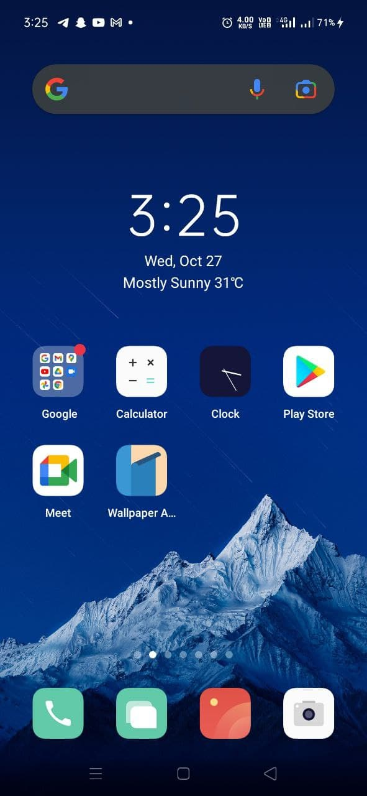
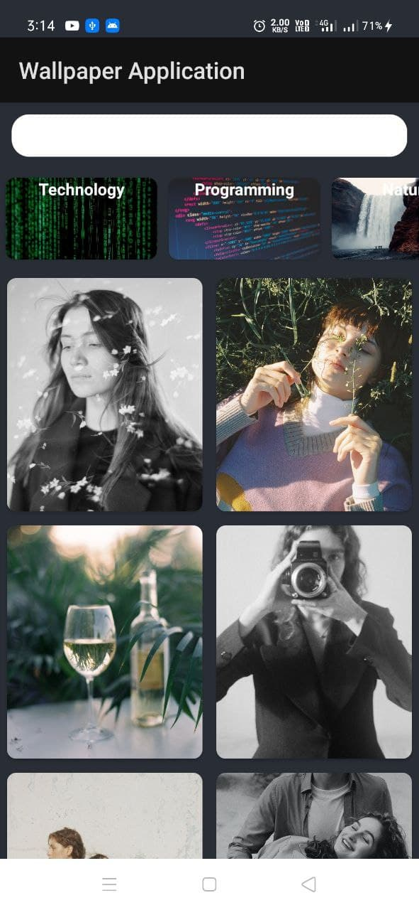
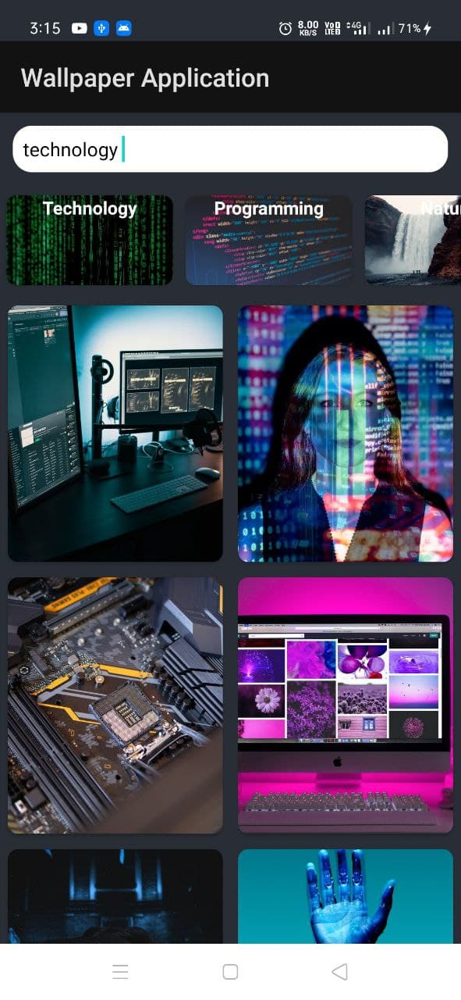
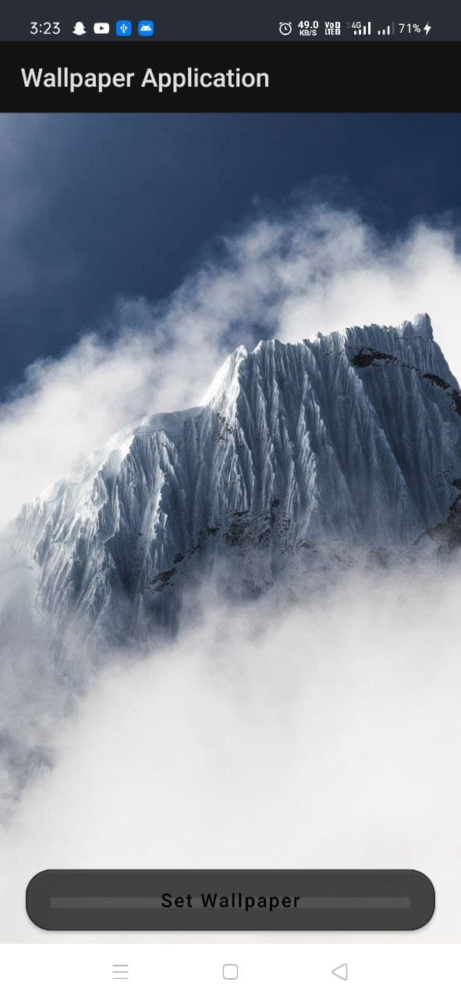
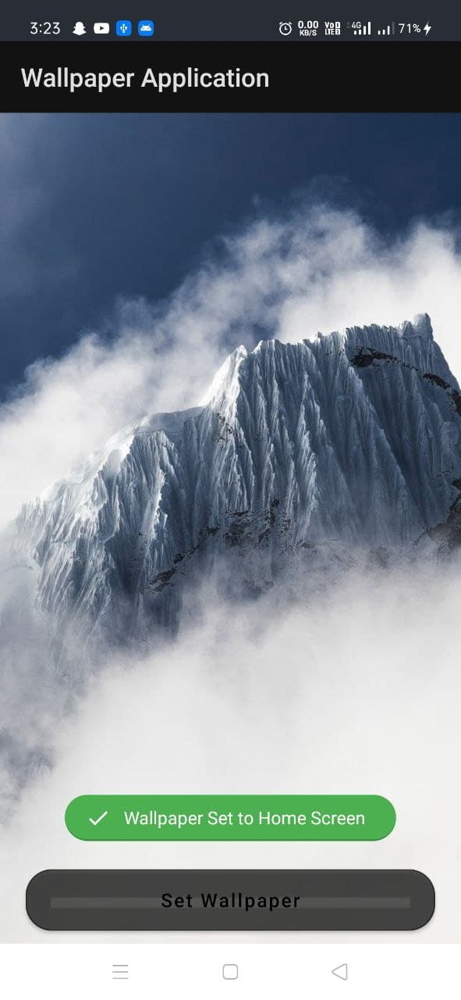

# WOOP-Wallpaper-Application

These is a **wallpaper application** made on Android Studio using java programming language where you can find your favorite wallpaper which you can easily select and set on any mobile devices.

•There are various category for your wallpaper such as Technology, Nature, Programming, Car, Music, Architecture etc and set marvelous wallpapers on your devices by one click. 

•Used glide library for image fetching & volley library for an HTTP library that makes networking for Android apps easier & internet connectivity.

•Created model, adapter, view holder.

•**Application View**

•**Home screen**

•**Search category**

•**Wallpaper selection**

•**Set wallpaper**

*For better understanding you can watch my age finder videos on my LinkedIn profile -https://www.linkedin.com/in/rajiljain
